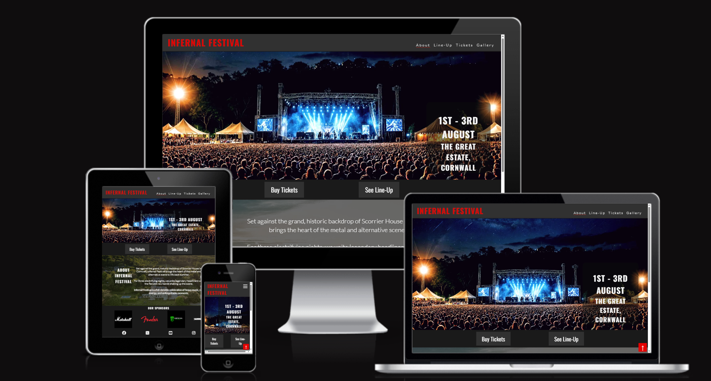

Project One: Infernal Festival Website
======================================
**Author:** *Tyler Worth*

# Project Description

Infernal Festival is a dynamic and interactive website designed to simulate the experience of an exciting design and experience of visiting and interacting with information in the promotional buildup for a hypothetical live festival event.
The Infernal Festival website hosts an engaging interface and vibrant design inspired by the metal music genre and industry trends featured by companies such as Metal Hammer Magazine and Download Festival.

# Website Purpose

The purpose of the Infernal Festival website for visitors is to share information for the (hypothetical) Infernal Festival event, view upcoming lineups of performing artists, receive purchasing and contact information and view visual collections of photography from previous events in addition to answering some user story generated frequently asked questions about the event and its proceedings for participation.

For the Infernal Festival clients themselves, the website features strong call to actions toward ticket sales and customer information to repeatedly direct them back to the ticket purchasing page, in addition to advertising the event itself and answering customers' frequently asked questions that may help them decide to attend the festival and purchase a ticket.

# Links

- Website Deployment: https://cutbacktg.github.io/infernal-festival/index.html
- Github Repository: https://github.com/CutbackTG/infernal-festival

# Features

Interactive UI: An engaging user interface with smooth scrolling and easy navigation.
Responsive Design: The website design is optimised for mobile, tablet, and desktop devices.
Ticket contact Form: Ahead of a ticket purchasing system, the website features a contact form for details on ticket purchasing and camping information as its minimum viable product (see MVP section)

# Technologies Used

- HTML5: For the structure and content of the website.
- CSS3: For styling the site with custom layouts and designs.
- Git: Version control to manage project files.
- GitHub Pages: Hosting the live version of the project.
- RealVisXL v5 Lightning: AI Generation of copyright-free images of simulated events and photography. Engine hosted by https://creator.nightcafe.studio/explore 

# Design

Minimalist colour palette design of Black, #1a1a1a & #e50000 for high contrast and elegant style.

Contemporary inspirations from the Netflix logo and website design for customer familiarisation.

https://www.netflix.com/gb/

In addition to the minimalistic branding and styling of Marshall amplifiers.

https://www.marshall.com/gb/en 

# UX

**User Stories**

**1. First-Time Visitor 1:**

*As a First-Time Visitor, I want to be able to easily navigate the site to find information about tour dates, ticket prices, and the festival line-up, so I don’t have to spend time searching for the details I need to decide to purchase tickets. I expect clear menus, sections, and call-to-action buttons that lead me to key pages like "Buy Tickets" and "Line-up."*

**Acceptance Criteria**
- There is a clear, intuitive main navigation menu visible at the top of every page.
- The navigation menu includes direct links to "Buy Tickets," "Line-up," and "About."
- Key pages like "Buy Tickets" and "Line-up" are reachable within one click from the homepage.
- Prominent call-to-action (CTA) buttons for "Buy Tickets" and "View Line-up" are placed on the homepage.
- Ticket sales page and the festival line-up are each clearly laid out on their own dedicated pages.
- The navigation adapts responsively for mobile (e.g., collapses into a hamburger menu).
- Site structure follows logical paths — no dead ends or hidden links.
- The homepage and other key pages include in-page links or banners pointing to "Buy Tickets" and "Line-up."
- Accessibility is considered (e.g., clear button labels, focus states, screen reader support).
- Users report finding tickets and line-up info quickly during usability testing (target: under 20 seconds).

**Tasks**

**Content Planning**
- Create content for "Tour Dates," "Ticket Prices," and "Festival Line-up" pages.
- Write strong CTA button text (e.g., "Get Your Tickets," "See the Full Line-up").

**Design**
- Design a clear navigation bar with prominent links to all key sections.
- Create homepage CTA sections (banner, feature blocks, or sticky buttons) linking directly to "Buy Tickets" and "Line-up."
- Design mobile navigation (hamburger menu) for smaller screens.

**Development**
- Build a consistent, site-wide header with a navigation menu.
Develop dedicated pages for:
- Ticket Prices (clear breakdown of pricing tiers, early bird discounts, etc.).
- Festival Line-up (artist names, times, stages if available).
- Implement anchor links and CTAs on the homepage to key pages.
- Set up a sticky header (optional) to keep navigation accessible while scrolling.

**Accessibility**
- Ensure navigation is keyboard navigable and screen reader friendly.
- Add clear focus indicators for clickable elements.
- Make CTA buttons descriptive (avoid "Click Here" — be specific, like "Buy Festival Tickets").

**Testing**
- Perform usability testing with first-time visitors — measure how long it takes them to find tour dates, ticket info, and line-up.
- Test navigation functionality across browsers and devices (desktop, mobile, tablet).
- Conduct accessibility audits using Lighthouse.

**Performance**
- Minimize any JavaScript or CSS that could slow down menu interactions.
- Optimise images/icons used in navigation.

**2. First-Time Visitor 2:**

*As a First-Time Visitor, I want to easily understand the main purpose of the site and learn more about the festival, so I can quickly determine if this is the kind of event I would enjoy attending. I want to see a visually striking homepage that showcases the festival’s vibe, past events, and overall atmosphere through videos, images, and key details.*

**Acceptance Criteria**
- The homepage clearly states the festival’s name, theme, and dates at first glance.
- A short, engaging headline and sub-headline explain what the festival is about.
- There is a prominent "About the Festival" section or call-to-action (CTA) leading to more information.
- High-quality videos and/or image galleries showcase past events and the overall vibe.
- The visual design feels exciting, modern, and aligned with the festival's identity.
- The site loads quickly despite media-rich content.
- The layout is responsive and mobile-friendly.
- Accessibility standards are met (e.g., alt text for images, video captions).
- First-time visitors should be able to answer "What is this event?" and "Does it interest me?" within 30 seconds of landing.

**Tasks**
Content Gathering
- Collect high-quality images and videos from past events.
- Write a concise and engaging festival description (headline + short paragraph).
- Gather key details (dates, location, major highlights).

**Design**
- Create a homepage wireframe that prioritizes visuals and key info above the fold.
- Design a visually striking hero section featuring a video or image carousel.
- Design an "About the Festival" section with CTA buttons for more details.

**Development**
- Implement the homepage layout using responsive design practices.
- Embed video(s) with auto-play muted option and fall-back images for slow connections.
- Add an image gallery section showcasing past events.
- Implement lightweight animations for a dynamic, engaging experience.

**Accessibility**
- Add alt text to all images.
- Make sure colour contrast and font sizes meet accessibility standards.

**Performance Optimization**
- Optimize all media assets for fast load times (compression, lazy loading).
- Test homepage speed and fix any issues slowing it down.

**Testing**
- Conduct user testing with first-time visitors to confirm they understand the festival within 30 seconds.
- Test responsiveness across different devices and browsers.

**3. First-time Visitor 3**

*As a First-Time Visitor, I want to locate social media links to check out the festival’s community and engagement, so I can see how popular and reputable the event is. I expect links to be easy to find and to lead me directly to platforms like Instagram, TikTok, and Facebook, where I can view festival highlights, band interactions, and community excitement.*

**Acceptance Criteria**
- Social media icons/links are prominently placed on the homepage (e.g., header, footer, or a sticky sidebar).
- Links lead directly to the festival’s official accounts on Instagram, TikTok, and Facebook (open in a new tab).
- The icons are easily recognizable, using standard, official platform logos.
- Social media links are also present on key pages like "Line-up," "About," and "Buy Tickets."
- Hover states or tooltips clarify the destination of each link (e.g., "Follow us on Instagram").
- Links are accessible (e.g., labelled properly for screen readers).
- Users can easily find and access the festival's social media presence within 10 seconds of landing on the site during testing.

**Tasks**

**Content and Assets**
- Collect official social media URLs for Instagram, TikTok, and Facebook.
- Prepare visual assets (icons or badges) for each platform if custom ones are needed.

**Design**
- Design a social media bar/section for the homepage
- Create a visually consistent set of social media icons that match the site’s design.

**Development**
- Add social media icons/links to site pages
- Ensure all social media links open in new tabs.
- Implement hover effects and accessible labels for icons.

**Accessibility**
- Ensure social media links are keyboard-navigable.
- Add descriptive aria-labels (e.g., ).
- Make sure icons have sufficient colour contrast and are visible on all backgrounds.

**Testing**
Test all social links to ensure they lead to the correct social media profiles.
Test appearance and functionality across browsers and mobile devices.
- Conduct user testing to confirm visitors can easily find and use the social media links within 10 seconds.

**Performance and Optimization**
- Optimize icons (SVG preferred for scalability and performance).

**4. Returning/ frequent User 4**

*As a Frequent User, I want to sign up for email or push notifications, so I never miss an important update about lineup changes, exclusive ticket sales, or last-minute schedule adjustments. I want to control my notification preferences to avoid spam but still get crucial alerts.

**Acceptance Criteria**
There is a clear option on the site inviting users to sign up for updates.
The sign-up form collects only necessary information (e.g., name, email, notification preferences).

**Content Creation**
Write a sign-up form and a confirmation modal.

**Design**
Design an attractive sign-up section or banner for the homepage and key pages.

**Development**
Create the sign-up form with fields for:
Name & Email address

**Wireframes**

Home Page Design Concept - Mobile first

Lineup Page Design Concept

# Testing & Accessibility

**Accessibility - Lighthouse Rating**

- This rating demonstrates good accessibility, best practices, and SEO, however, the images in .png or .jpg format take too long to load and need to be saved as .webp files for optimisation.

After some recommended optimisation of all images to .webp files with a size of under 100kb and reducing Google fonts to just two weighted classes, we have now achieved a slightly higher performance rating for the index.html page.

- a slightly slower load time due to the .mp4 file, but overall good scores.

- As expected from this relatively simple form page, excellent Lighthouse ratings across the board.

- This performance rating is to be expected with multiple images to load initially on page load.

**Bugs discovered**

**Solved Bugs:**

# Deployment

**Installation**
If you’d like to clone the project and work locally, follow these steps:

**Clone the repository:**

- Copy
`git clone https://github.com/cutbacktg/infernal-festival.git`
Navigate to the project directory:

- Copy
`cd infernal-festival`
Open index.html in a web browser to view the site.

**Deployment**

This section guides you through the process of deploying your web application to Github Pages from your project repository.

**Pre-requisites:**
- A github account.
- A github repository or clone of your web project already pushed to it.

**Step 1: Prepare Your Repository**
Check that your project is in a GitHub repository. If you haven't already created one, follow these steps:

1. Create a new repository on GitHub:
- Go to GitHub and log in.
- Click the + icon at the top-right of the page and select New repository.
- Name your repository (e.g., infernal-festival).
- Make sure to initialize the repository with a README file (optional).
- After creating the repository, you will see instructions to push an existing project.

2. Push your local project to Github (if you haven't already done so):
If you have an existing project:
- Open your terminal or command line and navigate to the project folder.

Use the following commands to push your project to Github:

- `git init`  # If your project isn't already a Git repository
- `git add .` # Add all files to the staging area
- `git commit -m "Initial commit"`  # Commit the changes
- `git branch -M main`  # Rename your default branch to 'main'
- `git remote add origin https://github.com/yourusername/infernal-festival.git`  # Replace with your repository URL
- `git push -u origin main`  # Push to GitHub

**Step 2: Enable Github Pages**

1. Navigate to the settings on your repository page on Github.
- Open the repository on Github.
- Click on the ***settings*** tab located in the top menu of your repository.

2. Find the Github Pages section:
- Scroll down until you find the ***Github Pages*** section under the ***Code and automation*** category.

3. Choose a source branch for deployment:
- In the ***Source*** dropdown, select the branch you want to deploy (usually ***main*** or ***master***)
- After selcting your branch, Github Pages will automatically start building and deploying the website

4. Select the root folder (if necessary):
- Usually the root folder will be enough. However, if you have your site in a specific folder (like ***/docs*** etc), choose that folder instead.
- If your website's ***index.html*** file is in the root of your repository, no folder selection is necessary.

5. Save the changes:
 - After selecting the branch and folder (if applicable), Github will begin deploying your site. This may take several minutes depending upon the size of your site.

 **Step 3: Access your live website**

 Once Github Pages has finished building your site, you can access it via a URL.

 1. Find your Github Pages URL:
 - In the ***Github Pages*** section under ***settings***, you will see a URL that will look like:
 https://yourusername.githuib.io/infernal-festival/ 
 - This URL is your live website (as stated previously, this may take a minute or two to appear, simply refresh the page periodically until it appears on the page)
 - Click the link to open your deployed website in your browser.

 **Step 4: Updating your website**

 Any time you make updates or changes to your project (e.g., editing HTML, CSS, or JavaScript), follow these steps to update your live website:

 1. Make changes to your project locally
 - Edit your files as needed in your local project directory as normal.

 2. Commit your changes in your Terminal or command line.
 - `git add .` (adds all changed files)
 - `git commit -m "Update website content"` (Commits your changes)

 3. Push the changes to Github:
 - `git push origin main` (Push to Github main branch)

 4. Wait for Github Pages to rebuild the site:
 - After pushing your changes, Github Pages will automatically rebuild your site with your new content.
 - Refresh the live URL to view your changes.

**Step 5: Troubleshooting**

Site not showing up after deployment?

- Double-check that your index.html file is in the root directory of your repository. GitHub Pages needs this file to display your website.
- Check for typos in your file names or references to other resources (like CSS or JS files).
- Make sure you've committed and pushed all your files to the repository.

Assets (images, CSS, etc.) not loading correctly?

- Ensure the file paths for your assets are correct. GitHub Pages is case-sensitive, so make sure file names are properly capitalized.

**Usage**

Once the site is open in your browser, users can:

Browse the site: View the event site, see the band line-up, contact for information on tickets and camping for the event and view the gallery of previous event photography.

**Contributing**

If you'd like to contribute to this project, feel free to fork the repository, make changes, and submit a pull request. Contributions are welcome to improve features, fix bugs, or enhance the UI.

- Fork the repository.
- Clone your forked version.
- Make your changes and commit them.
- Push your changes back to your fork.
- Submit a pull request with a description of your changes.

# Credits

**Acknowledgements**

Guidance: Special thanks to The Code Institute for their support in helping me build and refine this first project.

Inspiration: The concept for this web application was inspired by online festivals and immersive event websites.

# Code:

Glowing text tutorial code sourced from LambdaTest and then adapted to suit my project in line 94 of the #style.css file.

`.glow:hover {
  text-shadow: 0 0 10px #e50000, 0 0 20px #e50000, 0 0 30px #e50000, 0 0 40px #e50000, 0 0 50px #e50000
}`

And classified in from line 32 in the #index.html, Gallery, Lineup and Tickets source code.

`<nav>
    <ul id="menu">
      <li><a href="index.html" class="glow active">About</a></li>
      <li><a href="line-up.html" class="glow">Line-Up</a></li>
      <li><a href="tickets.html" class="glow">Tickets</a></li>
      <li><a href="gallery.html"class="glow">Gallery</a></li>
    </ul>
  </nav>
</header>`

https://www.linkedin.com/in/clinton-joy-538804244 (2025). Introducing The All New LT Browser 2.0!🖥️ | LambdaTest. [online] LambdaTest. Available at: https://www.lambdatest.com/blog/glowing-effects-in-css/ [Accessed 6 May 2025].

Code resourced to centre Modal to the centre of the screen by user Vlad Udod on the Stackoverflow website

`.center {
  position: absolute;
  left: 50%;
  top: 50%;
  transform: translate(-50%, -50%);
}`

And adapted on line 320 of my #style.css file

`.modal {
  display: none;
  position: fixed;
  z-index: 1000;
  left: 0;
  top: 0;
  width: 100%;
  height: 100%;
  background-color: rgba(0, 0, 0, 0.6);
}`

Stack Overflow (2024). Stack Overflow - Where Developers Learn, Share, & Build Careers. [online] Stack Overflow. Available at: https://stackoverflow.com/.

# Media:

All images and videos have been generated using Nightcafe's RealVisXL v5 Lightning: AI Generation of copyright-free images of simulated events and photography. Engine hosted by https://creator.nightcafe.studio/explore 
